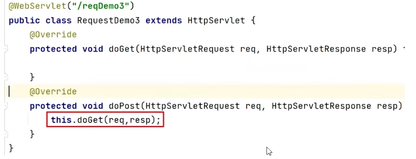
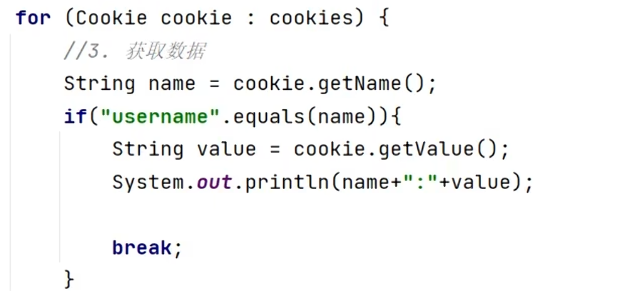

# 核心技术
## Request
* **理解**
    它是基于**servlet**技术下的，因为servlet的service方法参数就是Request和Response,是Httpservlet**Request**（和另一个）类里面已经定义好的对象。他们用来**接收你浏览器的请求**（Tomcat服务器会自己解析发来的请求文本，将对应的放到不同的方法里）
    需要自己手动写
  
* **HttpservletRequest类里面的方法,返回类型为String（在重写doGet 和 doPost方法中可以用）**
  * 请求行部分
    
   `String getMethod()`:获取请求方式:GET
  
   ` String getContextPath()`:   获取虚拟目录(项目访问路径):    /request-demo
  
   `StringBuffer getRequestURL()`:获取URL(统一资源定位符):http: // localhost:8080 /request-demo /req1

     `String getRequestURI()`:获取URI(统一资源标识符):/request-demo/req1
  
     `String getQueryString()`:获取请求参数(GET方式):username=zhangsan&password=123
   
    * 请求头部分：
   `String getHeader(String name)`:根据请求头名称,获取值

    * 请求体部分:
      `ServletlnputStream getlnputStream()`:获取字节输入流  
          `BufferedReader getReader()`:获取字符输入流  
        username=superbaby&password=123  

* **Request通用方式**
  因为doGet和doPost方法里面很多重复，所以可以用通用方式，不用写那么多代码了  
  模版：  
    
  在IDEA中有这个模版

* **传的数据为中文 乱码的问题**

    如果是Post方式:  
  只需要在doGet方法（Request通用方式了嘛，都加在这里）里加入这句：  
  `request.setCharacterEncoding("UTF-8"); ` //设置字符输入流的编码  
    如果是Get方式：  
    首先明确：浏览器是将中文以UTF-8进行编码传输的，而Tomcat是按ISO_8859_1进行解码的。所以需
    分开写  
    `byte[  ] bytes= username.getBytes(StandardCharsets.IS0_8859_1);`  
    `username = new String(bytes, StandardCharsets.UTF_8); `   
    合成一行（其实是get和post通用的解决方案）  
    `username = new String(username.getBytes(StandardCharsets.IS0_8859_1), StandardCharsets.UTF_8);|`  
    `System.out.println(“解决乱码后:"+username)`;  

* 请求转发（上传数据给服务器端的资源A，然后A转给资源B）
   
  代码：`req.getRequestDispatcher("资源B路径").forward(req,resp);`

 

## Response
* **重定向(资源A告诉浏览器去资源B，而不是从A直接去)**  
  `resp.setStatus(302);`  
  `resp.setHeader("location"(固定的不要修改) , "资源B的路径")`  
  简化方法  
 ` response.sendRedirect("B的路径")`

* **字符输出流**
    字符输出流用于向浏览器发送文本  
    `PrintWriter(类) writer = response.getWriter();` //获取字符流  
    `response. setHeader( "content-type"（固定不变）,  "text/html"（如果你想让浏览器解析html文件）);`  
    `writer.write( s: "aaa");`  
    `writer.write( s: "<h>aaa</h1>");`  
    获取字符流相当于拿了纸笔，write才是写  
    区分  
    `System.out.println() : `用在*服务器的控制台 / 日志*	开发时调试代码（看后台数据）  
    `writer.write()`	用在*客户端的浏览器页面*	给用户展示内容（前端可见）  

* **字节输出流**  
  - 流程    
*传入文件*  
`FileInputStream fis = new FileInputStream( name: "d://a.jpg");`  
*从指定文件获取response字节输出流*  
`ServletOutputStream os = response.getOutputStream();`  
*完成流的copy*  
`byte[] buff = new byte[1024];`  
`int len = 0;`  
`while ((len = fis.read(buff)) != -1){`  
`os.write(buff, off: 0,len);`  
`//关闭`  
`fis.close();`  
`}`  
  - IOUtils工具类快速书写  
  导入坐标  
`<dependency><groupld>commons-id</groupld>  
<artifactld>commons-io</artifactld>
<version>2.6</version>  
</dependency>`  
使用  
`IOUtils.copy(输入流,输出流);`  

## Cookie
- 接受cookie
- 发送cookie
  1. 创建Cookie对象
   `Cookie cookie = new Cookie("key","value");`
  2. 发送到客户端
   `response.addCookie(cookie);`  
- 获取cookie  
  3.获取客户端携带的所有Cookie,使用request对象  
    `Cookie[] cookies = request.getCookies();`  
  4.遍历数组,获取每一个Cookie对象:  
    
  5.使用Cookie对象方法获取数据  
    `cookie.getName();`  
    `cookie.getValue();`  
- **cookie存活：**  
    随浏览器关闭停止，用setMaxAge（int seconds）可以设置cookie存活时间  
- **cookie不能设置中文**  
  需要url解码传过去  
## Session
session其实是基于cookie通过JSESSIONID实现的  
- 获取session对象  
  - 获取  
   `HttpSession session = request.getSession();`  
- session功能  
  `void setAttribute(String name,Object o);`  
  存储数据到 session 域中  
    `Object getAttribute(String name);`  
    根据 key,获取值 **注意是Object，记得根据实际类型调整**  
    `Object setAttribute(String name,value);`  
    设置session(创建之后)  
    `void removeAttribute(String name)`:根据key,删除该键值对

   

