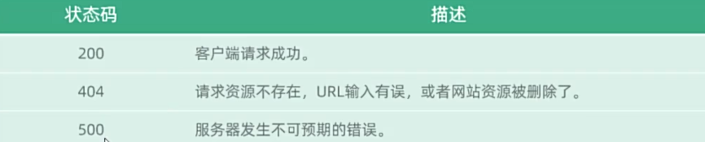
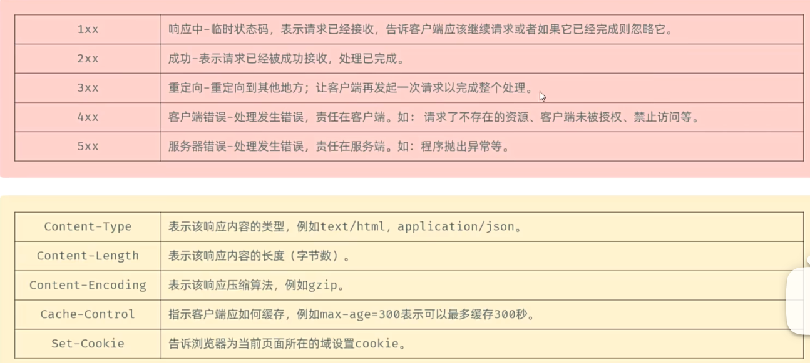
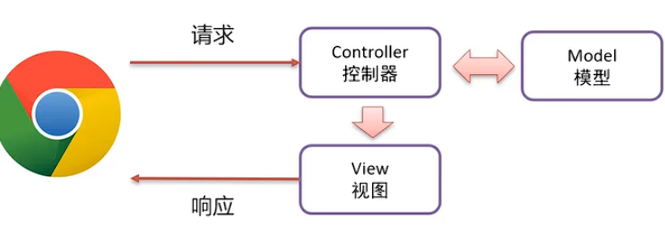
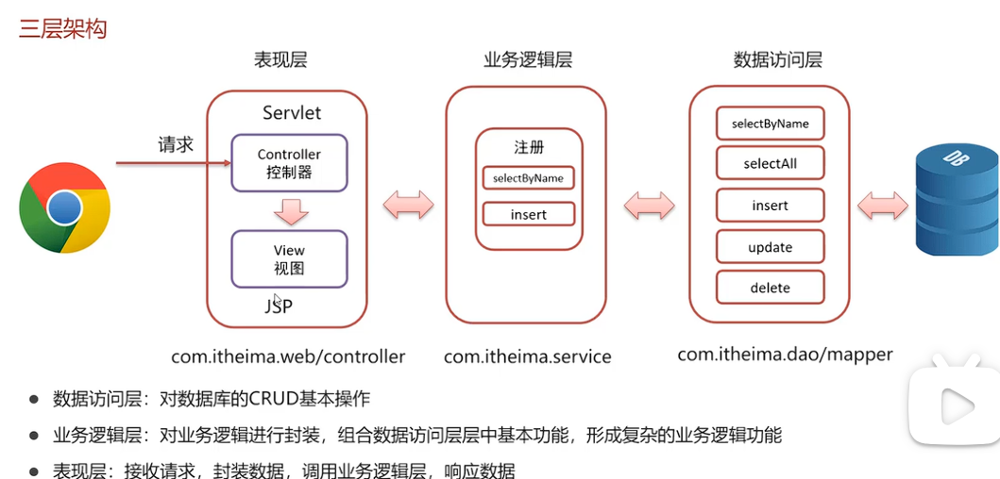

# 基础概念
## http协议
  * **概念**：浏览器和服务器之间用于传输数据的规则，传输的数据是纯文本

* **特点**
    1.基于TCP协议：三次握手
    2.每次请求独立，多次数据传输无法共享
    3.由服务器的Tomcat进行封装数据

==请求协议==
    **请求行**：`GET /hello?name=itheima HTTP/1.1`
    **请求头**  键：值
 

  * 请求行拆解
   请求方式 &nbsp;&nbsp;&nbsp;&nbsp;&nbsp;&nbsp;&nbsp;请求路径 &nbsp;&nbsp;&nbsp;&nbsp;&nbsp;&nbsp;&nbsp;&nbsp;&nbsp;&nbsp;&nbsp;&nbsp;&nbsp;&nbsp;&nbsp;&nbsp;&nbsp;&nbsp;&nbsp;&nbsp;&nbsp;&nbsp;&nbsp;&nbsp;&nbsp;&nbsp;&nbsp;&nbsp;&nbsp;&nbsp;&nbsp;&nbsp;&nbsp;&nbsp;&nbsp;&nbsp;&nbsp;协议版本

   * 请求体
    POST独有，是在{ }中放传输的数据，没有限制
    Get的在url中，有限制

* 获取请求内容（写request方法）
    .png)
    .png)

==响应数据==

## ==Servlet==
* 一种动态的web资源开发**技术**（编写会随着数据的不同而 不同 的程序）。它是java编写好的一个接口，要重写全部方法（别担心有简化方法）

* **==使用==**
  
  
  1 . 创建web项目,导入Servlet依赖坐标
在dependency中加入
`<dependency>
 <scope>provided</scope>
</dependency>`
  2.定义一个类,实现Servlet接口,并重写接口中所有方法,在service方法中输入一句话
  `public class ServletDemo1 implements Servlet {`
  `public void service()`
  `}`
  3.配置:在类上使用@WebServlet("/sevlet所在文件--> 用于在浏览器输入访问到这里")注解
  4.访问:启动Tomcat,浏览器输入URL访问该Servlet

* ==servlet方法介绍==
  1.初始化方法,在Servlet被创建时执行,只执行一次
  `void init(ServletConfig config)`
  2.提供服务方法,每次Servlet被访问,都会调用该方法
  `void service(ServletRequest req, ServletResponse res)`
  3.销毁方法,在内存释放或服务器关闭时销毁Servlet
  `void destroy()`
  4.获取ServletConfig对象
  `ServletConfig getServletConfig()`
  5.获取Servlet信息
  `String getServletInfo()`

* 简化重写方法（HttpServlet）
  就是让定义的servlet类去继承HttpServlet这个类（Servlet的一个子类），只需要重写（记得加@Override）里面的doGet和doPost方法就可以

## ==JSP（java server pages）==
- JSP = HTML + JAVA
- 三步走：导JSP坐标，建文件，写代码
- 有三种脚本

## ==MVC==
一种分层开发模式
M:Model,业务模型，处理业务(javabean充当模型)
V：View，视图，界面展示
C：Controller,控制器，处理请求 

三层架构（三大框架SSM基于这个模式）

