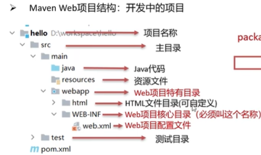
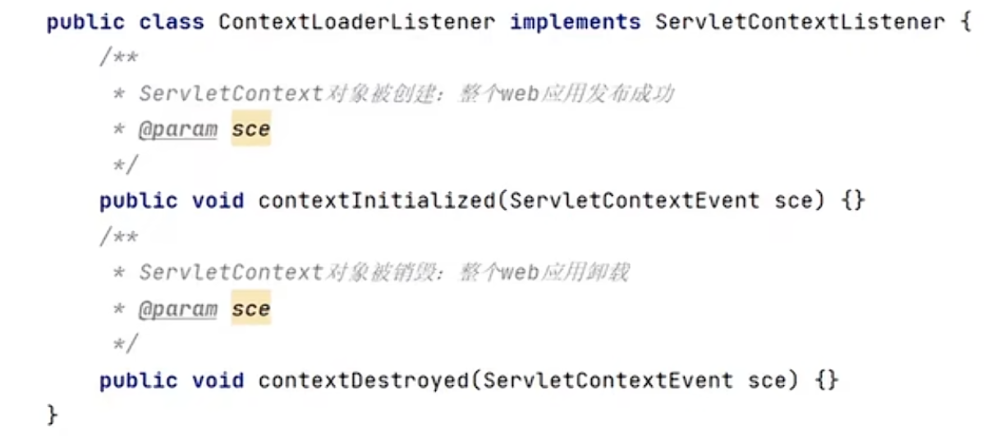

# 核心组件

## ==Tomcat==
* 是一个Web服务器，能够处理简化浏览器发来的 **HTTP 请求**，并将处理结果返回给浏览器，简化操作。还可以将写的Web项目部署到浏览器供大家使用查看。也称为Servlet容器  
* 部署  
  把项目文件移到Tomcat文件里webapps目录下，推荐打包成war包在传输，速度快（自动解压不用手动）  
* MavenWeb 文件  
   
 * 可在IDEA使用Tomcat，便于开发  
## ==Filter过滤器==
把请求拦截，进行一些特殊操作，一般是通用的请求。可以有多个过滤器  
- 创建步骤以及内部方法  
  - 定义类,实现Filter接口,并重写其所有方法  
 `public class FilterDemo implements Filter {`  
 `public void init(FilterConfig， filterConfig)`  
 重点方法↓  
 `public void doFilter(ServletRequest request，...很多)`  
 `public void destroy() {  }`  
 `}`  
  - 配置Filter拦截资源的路径:在类上定义@WebFilter **注解**  
  `@WebFilter("/*")`   /*表示任意拦截  
  - 在doFilter方法中输出一句话,并**放行**  
  `chain.doFilter(request, response);` 必须放行  
* 拦截路径细节  
  你可以拦截具体资源（比如index.jsp），整个目录，或者特定类型的文件（比如拦截所有.jsp文件）。在注解的括号里加  
## ==Listener==
- 创建  
    
- 注解：@Weblistener  
